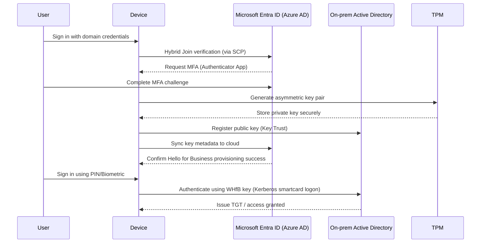

# 🚀 Deploying Windows Hello for Business (Key Trust + Azure AD MFA)

This guide walks through a full **A→Z deployment** of **Windows Hello for Business (WHfB)** using the **Key Trust** model integrated with **Azure AD Multi-Factor Authentication (MFA)**.

It’s designed for **hybrid environments** — where on-prem Active Directory (AD) and Microsoft Entra ID (Azure AD) are synchronized via **Azure AD Connect**.

---

## 📘 Table of Contents
1. [Overview](#overview)
2. [Prerequisites](#prerequisites)
3. [Enable Hybrid Azure AD Join](#enable-hybrid-azure-ad-join)
4. [Configure Windows Hello for Business GPO](#configure-windows-hello-for-business-gpo)
5. [Enable Azure AD MFA](#enable-azure-ad-mfa)
6. [Provisioning Flow](#provisioning-flow)
7. [Verification](#verification)
8. [Testing Sign-In](#testing-sign-in)
9. [Rollout & Monitoring](#rollout--monitoring)
10. [Summary](#summary)
11. [References](#references)

---

## 🧭 Overview

**Windows Hello for Business (WHfB)** replaces passwords with **strong two-factor authentication** using:
- **Something you have** – a registered, trusted device (TPM-protected key).
- **Something you are or know** – PIN or biometric gesture.

When paired with **Azure AD MFA**, the provisioning process ensures strong identity verification and passwordless sign-ins for both **on-prem** and **cloud** resources.

---

## ⚙️ Prerequisites

| Component | Requirement |
|------------|-------------|
| **Windows Server** | Domain Controllers on **Windows Server 2016+** (required for Key Trust). |
| **Azure AD Connect** | Sync **users + computers**; Hybrid Azure AD Join must be configured. |
| **Licensing** | Microsoft Entra ID **P1 or P2** for Conditional Access / MFA. |
| **Client OS** | Windows **10/11 Pro or Enterprise (v1903+)**. |
| **MFA** | Each user must register MFA (Authenticator app preferred). |
| **Network** | Outbound HTTPS (443) to:<br>`login.microsoftonline.com`, `aadcdn.msftauth.net`, `graph.microsoft.com`. |
| **Hardware** | Devices with TPM 2.0 recommended. |

---

## 🔗 Enable Hybrid Azure AD Join

1. Open **Azure AD Connect** → choose **Configure device options**.  
2. Select **Configure Hybrid Azure AD Join** → click **Next**.  
3. Choose your **AD forest** and authentication method (**PHS** or **PTA**).  
4. Check **Windows 10 and later domain-joined devices**.  
5. Complete wizard – it creates a **Service Connection Point (SCP)** in AD.

### ✅ Verify Device Join
On a client PC:

```powershell
dsregcmd /status
AzureAdJoined : YES
DomainJoined  : YES
```


## 🧩 Configure Windows Hello for Business GPO

Open the **Group Policy Management Console** and create/edit a GPO linked to your target OU.

**Path:**  
`Computer Configuration → Administrative Templates → Windows Components → Windows Hello for Business`

Set:

|Policy|Setting|
|---|---|
|Use Windows Hello for Business|**Enabled**|
|Use a hardware security device|**Enabled**|
|Use certificate for on-premises authentication|**Disabled**|
|Allow biometrics|**Enabled (optional)**|

💡 _Scope this GPO to pilot devices or a test OU first._

---

## 🔐 Enable Azure AD MFA

1. Go to **Entra Admin Center → Protection → Authentication methods**.
    
2. Enable **Microsoft Authenticator** for users.
    
3. Ask users to register via https://aka.ms/mfasetup.
    
4. (Optional) Create a **Conditional Access policy** to require MFA during WHfB provisioning.
    

---

## 🧱 Provisioning Flow

When a user signs in on a **Hybrid Azure AD Joined** device:

1. **Azure AD MFA** challenge is triggered (Authenticator app or SMS).
    
2. The device **creates a key pair** (private key in TPM).
    
3. **Public key** is registered in **Active Directory** and **Azure AD**.
    
4. Subsequent logons use **PIN/biometric + key**, not a password.
    
5. Sign-ins are validated by **on-prem KDC (Key Distribution Center)** using Key Trust.



---

## 🧾 Verification

After WHfB provisioning, run:

`dsregcmd /status`

Check for:

`NgcSet     : YES NgcKeyId   : {GUID} AzureAdJoined : YES DomainJoined  : YES`

✅ The device is now fully enrolled with Windows Hello for Business (Key Trust).

---

## 🧪 Testing Sign-In

- Lock and unlock the device using **PIN or biometric** → no password prompt.
    
- Access a network share or printer (\Server\Share).
    
    - In DC logs you’ll see `Authentication Type: 11 (Smartcard Logon)` — confirming WHfB key-based Kerberos authentication.
        


## 📊 Rollout & Monitoring

1. Start with a **pilot group** (5–10 users).
    
2. Monitor logs:
    
    - `Event Viewer → Microsoft → Windows → User Device Registration`
        
    - `Event Viewer → Microsoft → Windows → HelloForBusiness`
        
3. Expand to production gradually.
    
4. Define **fallback methods** (FIDO2, Temporary Access Pass).
    
5. Review devices in **Entra ID → Devices → All Devices**.
    

---

## 🧩 Summary

|Aspect|Result|
|---|---|
|PKI Required|❌ No|
|Passwordless|✅ Yes|
|Hybrid Join Required|✅ Yes|
|MFA During Enrollment|✅ Yes|
|Works On-Prem & Cloud|✅ Yes|
|Difficulty|⭐⭐ Easy–Moderate|
|Recommended For|Hybrid AD environments without PKI|

---

## 📚 References

- [Microsoft Learn – WHfB Key Trust Deployment](https://learn.microsoft.com/en-us/windows/security/identity-protection/hello-for-business/deploy/hybrid-key-trust-enroll?utm_source=chatgpt.com)
    
- [Microsoft Learn – How Windows Hello for Business Works](https://learn.microsoft.com/en-us/windows/security/identity-protection/hello-for-business/how-it-works?utm_source=chatgpt.com)
    
- Azure AD Hybrid Join Setup Guide
    
- [MatrixPost – Setup WHfB for Hybrid Devices](https://blog.matrixpost.net/set-up-windows-hello-for-business-hybrid-azure-ad-joined-devices/?utm_source=chatgpt.com)
    
- Microsoft Entra ID MFA Documentation

